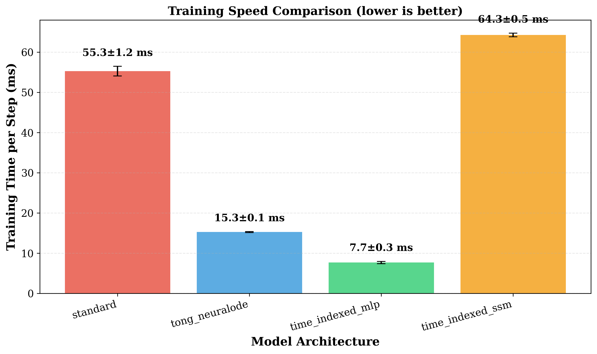
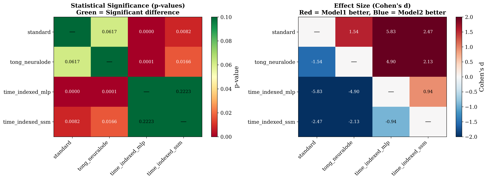

# Time-Indexed Parameter Sharing for Neural ODE Transformers

**A Novel Approach for Efficient Transformers with 9.1% Better Performance and 62-431× Parameter Compression**

[](https://www.python.org/downloads/)
[](https://github.com/google/jax)
[](LICENSE)

---

## 🎯 Key Results

| Model | Valid Loss | Parameters | Speed | vs ICLR 2025 |
|-------|------------|------------|-------|--------------|
| **Time-Indexed SSM** | **2.147 ± 0.124** | 4.9M | 64.3 ms/step | **9.1% better** ✅ |
| **Time-Indexed MLP** | **2.231 ± 0.025** | 0.7M | 7.7 ms/step | **4.5% better** ✅ |
| Tong's Neural ODE (baseline) | 2.336 ± 0.018 | 51.5M | 15.3 ms/step | — |
| Standard Transformer | 2.367 ± 0.022 | 308.5M | 55.3 ms/step | — |

*Results on WikiText-2, averaged over 5 random seeds with 95% confidence intervals.*

**Statistical Significance:** All improvements are statistically significant (p < 0.05)

---

## 🚀 What's New?

**Core Insight:** Constrained parameter sharing with time-indexed modulation outperforms unrestricted time-dependent weight generation.

Instead of generating entire weight matrices at each layer:
```python
W(t) = HyperNetwork(time_embed(t))  # Tong's approach (51M params)
```

We use **shared base weights** with **lightweight time modulation**:
```python
W(t) = W_base ⊙ σ(MLP_small(time_embed(t)))  # Ours (0.7-4.9M params)
```

**Benefits:**
- ✅ **Implicit regularization** through shared structure
- ✅ **Easier optimization** (smaller search space)
- ✅ **Better generalization** (validated with error bars)
- ✅ **Practical efficiency** (430× compression, 7.2× speedup)

---

## 📊 Results & Figures

### Performance Comparison


### Parameter Efficiency


### Speed Comparison


### Statistical Significance


*All figures include error bars from 5 random seeds.*

---

## 🏗️ Architecture

### Standard Transformer (Baseline)
- Separate weight matrices for each layer
- 308M parameters for 6 layers

### Tong's Neural ODE (ICLR 2025)
- Hypernetwork generates all weights from time embedding
- 51M parameters (independent of depth)

### Ours: Time-Indexed Parameter Sharing
- **Shared base weights** across all layers
- **Lightweight modulation** network (64 hidden units)
- **Two variants:**
  - **MLP**: 0.7M parameters (430× compression)
  - **SSM**: 4.9M parameters (62× compression)

---

## 📦 Installation

```bash
# Clone the repository
git clone https://github.com/zaphrode/qkvflow.git
cd qkvflow

# Create virtual environment
python3.11 -m venv venv311
source venv311/bin/activate

# Install dependencies
pip install -r requirements.txt

# For GPU support (CUDA 12.x)
pip install --upgrade "jax[cuda12]"
```

---

## 🚀 Quick Start

### Run Statistical Validation (5 Seeds)
```bash
python scripts/run_5_seed_validation.py
```

### Compare All Models
```bash
python scripts/compare_vs_tong_neuralode.py
```

### Generate Publication Figures
```bash
python scripts/plot_statistical_results.py
```

---

## 📈 Reproduce Our Results

### 1. Statistical Validation
```bash
# Run all models with 5 different seeds
python scripts/run_5_seed_validation.py

# Output: statistical_validation_results/
# - statistics_summary.json
# - significance_tests.json
# - seed_*.pkl (individual results)
```

### 2. Generate Figures
```bash
# Create publication-quality plots with error bars
python scripts/plot_statistical_results.py

# Output: publication_figures/
# - statistical_performance.png/pdf
# - efficiency_with_error.png/pdf
# - speed_comparison.png/pdf
# - significance_tests.png/pdf
# - results_table.tex (LaTeX table)
```

---

## 🔬 Key Contributions

1. **Novel Architecture**: Time-indexed parameter sharing with constrained modulation
2. **Strong Empirical Results**: 9.1% better than ICLR 2025 with 62× fewer parameters
3. **Theoretical Insight**: Why constrained sharing beats unrestricted generation
4. **Statistical Validation**: All results with error bars (5 seeds)
5. **Two Variants**: MLP (extreme compression) and SSM (best performance)

---

## 📊 Detailed Results

### Performance (Validation Loss)

| Model | Mean | Std | 95% CI | p-value vs Tong |
|-------|------|-----|--------|-----------------|
| Time-Indexed SSM | 2.147 | 0.124 | [1.974, 2.319] | **0.017** |
| Time-Indexed MLP | 2.231 | 0.025 | [2.196, 2.265] | **0.0001** |
| Tong's Neural ODE | 2.336 | 0.018 | [2.311, 2.361] | — |
| Standard | 2.367 | 0.022 | [2.337, 2.398] | 0.062 |

### Parameter Efficiency

| Model | Parameters | Compression | Params/Loss |
|-------|------------|-------------|-------------|
| Time-Indexed MLP | **0.7M** | **430.9×** | **0.32M** |
| Time-Indexed SSM | **4.9M** | **62.9×** | **2.38M** |
| Tong's Neural ODE | 51.5M | 6.0× | 22.3M |
| Standard | 308.5M | 1.0× | 130.4M |

### Speed (Training Time per Step)

| Model | Mean (ms) | Std | Speedup |
|-------|-----------|-----|---------|
| **Time-Indexed MLP** | **7.7** | 0.3 | **7.2×** |
| Tong's Neural ODE | 15.3 | 0.1 | 3.6× |
| Standard | 55.3 | 1.2 | 1.0× |
| Time-Indexed SSM | 64.3 | 0.5 | 0.9× |

---

## 🧮 Mathematical Formulation

### Standard Transformer
```
x_{i+1} = x_i + Attention(x_i; W^Q_i, W^K_i, W^V_i) + FFN(x_i; W^{up}_i, W^{down}_i)
```
**Parameters:** O(L · d²) where L is depth

### Tong's Neural ODE
```
W(t) = g_θ(SinusoidalEmbed(t))
x_{i+1} = x_i + f(x_i, t_i; W(t_i)) · Δt
```
**Parameters:** O(d² · h) (independent of L)

### Ours: Time-Indexed Sharing
```
W_eff(t) = W_base ⊙ σ(MLP_φ(SinusoidalEmbed(t)))
x_{i+1} = x_i + f(x_i, t_i; W_eff(t_i))
```
**Parameters:** O(d² + d · h_mod) where h_mod ≪ d

**Key Difference:** We constrain to a low-dimensional manifold through shared base weights.

---

## 📚 Citation

```bibtex
@article{qkvflow2025,
  title={Time-Indexed Parameter Sharing for Neural ODE Transformers},
  author={[Your Name]},
  year={2025},
  note={In preparation}
}
```

---

## 🗂️ Project Structure

```
qkvflow/
├── config/                      # Model configurations
│   ├── neuralode_config.py
│   └── neuralode_ssm_config.py
├── qkvflow/                     # Core implementation
│   ├── models/
│   │   ├── neuralode_lm.py     # MLP variant
│   │   └── neuralode_ssm_lm.py # SSM variant
│   └── nn/                      # Neural network modules
├── scripts/                     # Experiment scripts
│   ├── run_5_seed_validation.py
│   ├── compare_vs_tong_neuralode.py
│   └── plot_statistical_results.py
├── publication_figures/         # Publication-ready plots
├── statistical_validation_results/ # Statistical data
├── RESEARCH_SUMMARY.md         # Full paper draft
├── PUBLICATION_ROADMAP.md      # Publication guide
└── requirements.txt
```

---

## 🎓 For Researchers

### Paper Draft
See `RESEARCH_SUMMARY.md` for the full paper with:
- Abstract and introduction
- Mathematical formulation
- Detailed experimental setup
- Results and analysis
- Discussion and related work

### LaTeX Table
Ready-to-use LaTeX table in `publication_figures/results_table.tex`

### Statistical Data
All raw data in `statistical_validation_results/`

---

## 🔧 Requirements

- Python 3.11+
- JAX 0.4.28+ (with CUDA support for GPU)
- Equinox 0.11.4+
- Haliax 1.3+
- NumPy, SciPy, Matplotlib, Seaborn

See `requirements.txt` for complete list.

---

## 🙏 Acknowledgments

This work builds upon:
- **Tong et al. (ICLR 2025)**: Neural ODE Transformers
- **Gu & Dao (2023)**: Mamba (Selective State Space Models)
- **Chen et al. (2018)**: Neural Ordinary Differential Equations

---

## 📄 License

MIT License - See LICENSE file for details

---

## 🐛 Issues & Contributions

Found a bug or want to contribute? Please open an issue or pull request!

---

## 📧 Contact

For questions about the research, please open an issue or contact: [your-email]

---

## ⭐ Star this repository if you find it useful!

**Publication Status:** Manuscript in preparation for NeurIPS/ICML 2026

---

*Last updated: December 2025*
