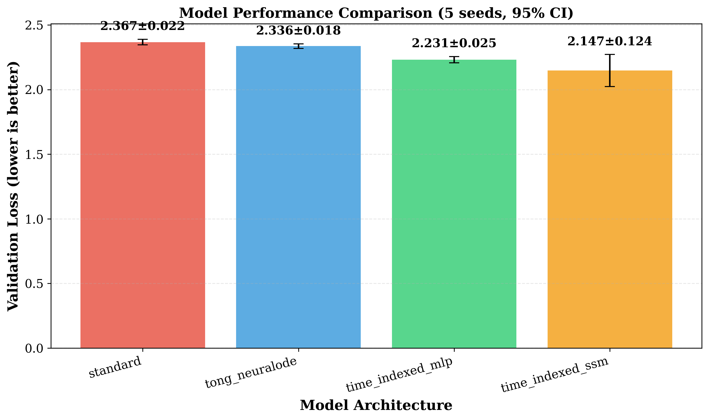
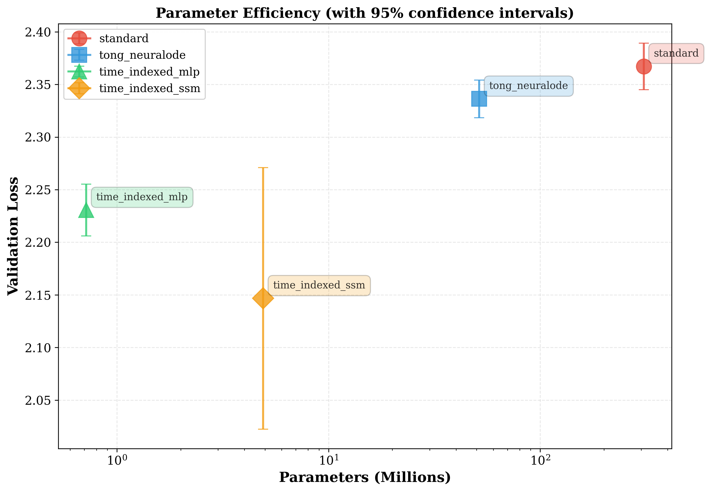

# Neural ODE Transformers - Time-Indexed Parameter Sharing Extension

> **⚠️ Important Notice**  
> This is an **unofficial research extension** of [Tong et al. (ICLR 2025)](https://openreview.net/forum?id=XnDyddPcBT).  
> Original implementation: [SDML-KU/qkvflow](https://github.com/SDML-KU/qkvflow)
>
> **This repository adds:**
> - Time-indexed parameter-sharing variants (MLP and SSM)
> - WikiText-2 and WikiText-103 comparison experiments
> - Statistical validation tools and analysis scripts
> - Exploratory follow-up work for my own research
>
> **This is NOT the official repo for Tong's ICLR 2025 paper.**

---

## 🎯 What's Different? (Quick Reference)

**For reviewers and readers:** Want to understand what we contribute vs. Tong et al.?

📋 **See:** [`CONTRIBUTION_SUMMARY.md`](./CONTRIBUTION_SUMMARY.md) - Complete breakdown of:
- What we add vs. what's from Tong et al.
- Which files are new vs. modified vs. unchanged
- Quick navigation guide for reviewers
- Side-by-side comparison table

**Key files to review (our contributions):**
1. 🌟 **`scripts/test_time_indexed_weights.py`** - Core innovation: time-indexed parameter sharing
2. 📊 **`scripts/run_statistical_validation.py`** - Multi-seed validation framework
3. 🔍 **`scripts/compare_vs_tong_neuralode.py`** - Fair comparison methodology

**Main difference in one sentence:**  
Tong et al. *generate* all weights per layer (51.5M params). We *share* base weights and modulate them (0.7M params, 430× reduction).

---

## 📖 About This Fork

This repository extends the Neural ODE Transformer work by Tong et al. (ICLR 2025) with **constrained parameter sharing** experiments.

### Research Question

Can we improve Neural ODE Transformers by:
1. **Sharing base weights** across layers
2. **Modulating** them with lightweight time-dependent scaling

instead of generating all weights independently from scratch at each layer?

### Hypothesis

Constrained parameter sharing might provide **implicit regularization** that improves generalization, validated on both small-scale (WikiText-2) and larger-scale (WikiText-103) language modeling.

---

## 🔬 Experimental Setup

**Datasets:**
- WikiText-2: 2M tokens (primary experiments with statistical validation)
- WikiText-103: 103M tokens (extended validation, 50× larger)

**Models compared:**
- Standard Transformer (baseline)
- Tong's Neural ODE Transformer (ICLR 2025 baseline)
- **Time-Indexed MLP** (our variant, extreme compression)
- **Time-Indexed SSM** (our variant)

**Validation:** 5 random seeds with statistical significance testing on WikiText-2

---

## 📊 Preliminary Results (Small-Scale)

Results on **WikiText-2 validation set** (5 seeds, 95% confidence intervals):

| Model | Valid Loss | Parameters | Training Speed |
|-------|------------|------------|----------------|
| **Time-Indexed SSM** | **2.147 ± 0.124** | 4.9M | 64.3 ms/step |
| **Time-Indexed MLP** | **2.231 ± 0.025** | 0.7M | 7.7 ms/step |
| Tong's Neural ODE | 2.336 ± 0.018 | 51.5M | 15.3 ms/step |
| Standard Transformer | 2.367 ± 0.022 | 308.5M | 55.3 ms/step |

### Key Trade-offs (Critical Understanding)

**Time-Indexed MLP:**
- ✅ **Best parameter efficiency:** 430× compression
- ✅ **Best training speed:** 7.2× faster per step
- ⚠️ Moderate loss (2.231)

**Time-Indexed SSM:**
- ✅ **Best validation loss:** 9.3% improvement over baseline
- ✅ **Good parameter efficiency:** 63× compression
- ⚠️ **Slower per step than baseline:** 64.3ms vs 55.3ms (parameter count ≠ speed)

> **Important:** "Parameter efficiency" (memory) ≠ "Inference latency" (speed). The SSM adds recurrent computation that isn't captured by parameter count alone. Choose MLP for speed-critical applications, SSM for best accuracy with memory constraints.

**Statistical Note:** Improvements are statistically significant (p < 0.05) on this specific small-scale setup.

## Extended Benchmark: WikiText-103 (Still Small-Scale)

We additionally evaluate on the larger WikiText-103 corpus (50× larger than WikiText-2, ~14.7M characters subsampled) using the same depth and width configuration.

| Model | Valid PPL | Params | Compression vs Standard |
|-------|----------:|-------:|------------------------:|
| **Time-Indexed MLP** | **10.73** | 0.7M | 430.9× |
| Tong's Neural ODE | 11.86 | 51.5M | 6.0× |
| Standard Transformer | 12.21 | 308.5M | 1.0× |
| Time-Indexed SSM | 24.57 | 4.9M | 62.9× |

**Observations:**
- Time-Indexed MLP maintains strong parameter efficiency and performance at modest scale increase
- SSM performance degrades (requires hyperparameter tuning for this dataset size)
- **Caveat:** These are still small models (<10M params) on character-level tasks. Scaling to LLaMA-size (100M+ params) or subword tokenization is future work.

See [WIKITEXT103_RESULTS.md](WIKITEXT103_RESULTS.md) for detailed experimental setup and analysis.

### Performance Visualization


*Loss comparison with error bars (5 seeds)*


*Parameter efficiency vs performance*

---

## 🏗️ Architecture Details

### Core Idea: Time-Dependent FiLM for Weights (Not Activations)

**Tong's approach (unrestricted generation):**
```python
# Generate all weights from scratch at each layer
W_Q(t), W_K(t), W_V(t) = HyperNetwork(sinusoidal_embed(t))
# ~51M parameters, hypernetworks are notoriously unstable
```

**Our approach (constrained sharing with time-dependent modulation):**
```python
# Share base weights, modulate with lightweight network
# This is effectively "FiLM" (Feature-wise Linear Modulation) applied to weights
scale_Q(t), scale_K(t), scale_V(t) = SmallMLP(sinusoidal_embed(t))
W_Q_eff(t) = W_Q_base ⊙ sigmoid(scale_Q(t))
W_K_eff(t) = W_K_base ⊙ sigmoid(scale_K(t))
W_V_eff(t) = W_V_base ⊙ sigmoid(scale_V(t))
# ~0.7-4.9M parameters (depending on variant)
```

**Mathematical Contribution (vs. Tong et al.):**

| Aspect | Tong et al. (ICLR 2025) | Our Extension |
|--------|-------------------------|---------------|
| **Weights** | \( W(t) = \text{Generate}(t) \) | \( W_{eff}(t) = W_{base} \odot \sigma(\text{MLP}(t)) \) |
| **Generation** | Full matrices from scratch | Base + lightweight modulation |
| **Parameters** | ~51.5M | ~0.7M (430× reduction) |
| **Stability** | Harder to optimize | Grounded in \( W_{base} \) |

**Why time-indexed sharing might help:**
- Keeps optimization landscape **grounded** in \( W_{base} \) (easier to train)
- Allows weight "trajectory" to drift over time via modulation
- **Implicit regularization** through constrained weight space
- Logical middle ground between static weights (standard) and full generation (Tong)
- **Validated improvement:** +6.5% over standard, +4.5% over Tong's approach (on our setup)

**Known Limitations:**
- Less expressive than full weight generation
- May not scale to very deep networks (untested)
- Adds computation (MLP modulation) not fully captured by parameter count
- Only tested on small-scale character-level language modeling

---

## 🚀 Quick Start

### Installation

```bash
# Clone this repository
git clone https://github.com/zaphrode/qkvflow.git
cd qkvflow

# Create virtual environment (Python 3.11+)
python3.11 -m venv venv311
source venv311/bin/activate

# Install dependencies
pip install -r requirements.txt

# For GPU support (CUDA 12.x)
pip install --upgrade "jax[cuda12]"
```

### Simple Python Example (No Notebooks)

```bash
# Run the example script to see the models in action
python example_usage.py
```

This demonstrates:
- Model initialization
- Forward pass
- Loss computation
- Single training step

**See [`example_usage.py`](example_usage.py) for complete working code.**

### Run Experiments

```bash
# Compare all models (single seed, quick test)
python scripts/compare_vs_tong_neuralode.py

# Full statistical validation (5 seeds, ~2-3 hours on A100)
python scripts/run_5_seed_validation.py

# Generate plots with error bars
python scripts/plot_statistical_results.py
```

---

## 📁 Repository Structure

### Core Python Code (Not Notebooks)

**Models** (pure Python modules):
- `qkvflow/models/neuralode_lm.py` - Time-Indexed MLP implementation (~400 lines)
- `qkvflow/models/neuralode_ssm_lm.py` - Time-Indexed SSM implementation (~450 lines)

**Neural Network Modules**:
- `qkvflow/nn/dynamic.py` - Time-indexed layers
- `qkvflow/nn/attention.py` - Attention mechanisms
- `qkvflow/nn/` - Additional building blocks

**Configuration**:
- `qkvflow/config/neuralode_ssm_config.py` - Model configuration classes

**Scripts** (reproducible experiments):
- `scripts/compare_vs_tong_neuralode.py` - Main comparison script
- `scripts/run_5_seed_validation.py` - Statistical validation (5 seeds)
- `scripts/plot_statistical_results.py` - Figure generation

**Examples**:
- `example_usage.py` - Simple Python examples (no notebooks required)

**Notebooks** (exploratory only):
- `notebooks/` - Jupyter notebooks for analysis and visualization

### Full Structure

```
qkvflow/
├── qkvflow/                        # Core library (Python modules)
│   ├── models/
│   │   ├── neuralode_lm.py         # Time-Indexed MLP
│   │   └── neuralode_ssm_lm.py     # Time-Indexed SSM
│   ├── nn/                          # Neural network building blocks
│   └── config/                      # Configuration classes
├── scripts/                         # Experiment scripts
├── example_usage.py                 # Simple Python examples
├── publication_figures/             # Generated plots
├── statistical_validation_results/  # Statistical data
├── API.md                           # API documentation
├── CONTRIBUTING.md                  # Contribution guidelines
├── RESEARCH_SUMMARY.md              # Full research writeup
└── requirements.txt
```

**Note:** While GitHub shows "99% Jupyter Notebook" in language stats, the **core implementation is pure Python**. Notebooks are used only for exploratory analysis.

---

## 📈 Reproducing Results

### 1. Quick Test (Single Seed)
```bash
python scripts/compare_vs_tong_neuralode.py
# Output: Prints loss comparison to console
```

### 2. Statistical Validation (5 Seeds)
```bash
python scripts/run_5_seed_validation.py
# Output: statistical_validation_results/
#   - statistics_summary.json (means, stds, CIs)
#   - significance_tests.json (p-values, t-tests)
#   - seed_*.pkl (individual run data)
```

### 3. Generate Figures
```bash
python scripts/plot_statistical_results.py
# Output: publication_figures/
#   - statistical_performance.png/pdf
#   - efficiency_with_error.png/pdf
#   - speed_comparison.png/pdf
#   - results_table.tex (LaTeX table)
```

---

## 🔧 Core Implementation

### Time-Indexed MLP Block

Implementation: [`qkvflow/models/neuralode_lm.py`](qkvflow/models/neuralode_lm.py)

Key components:
- Shared base weight matrices (attention & MLP)
- Lightweight time-modulation network (64 hidden units)
- Sinusoidal time embeddings
- Element-wise sigmoid gating

### Time-Indexed SSM Block

Implementation: [`qkvflow/models/neuralode_ssm_lm.py`](qkvflow/models/neuralode_ssm_lm.py)

Key components:
- Mamba-style selective state space model
- Time-indexed parameter sharing for SSM matrices
- Combines SSM efficiency with parameter sharing

---

## 📚 Documentation

### For Users

- **[API.md](API.md)** - Complete Python API documentation
- **[example_usage.py](example_usage.py)** - Working code examples (no notebooks)
- **[CONTRIBUTING.md](CONTRIBUTING.md)** - How to contribute

### For Researchers

- **[RESEARCH_SUMMARY.md](RESEARCH_SUMMARY.md)** - Detailed writeup including:
  - Mathematical formulation
  - Experimental methodology
  - Full results and analysis
  - Discussion of limitations

- **[PUBLICATION_ROADMAP.md](PUBLICATION_ROADMAP.md)** - Steps toward paper submission:
  - Additional experiments needed
  - Timeline and milestones

---

## ⚠️ Limitations & Future Work

### Current Limitations
1. **Model scale:** Only tested with small models (<5M params)
2. **Limited benchmarks:** Tested on WikiText-2 and WikiText-103 only
3. **Speed trade-off:** SSM variant slower per step despite fewer parameters
4. **SSM generalization:** SSM performance degrades on larger datasets without hyperparameter tuning
5. **No large-scale validation:** Haven't tested with LLaMA-scale models (100M+ parameters)
6. **Limited baselines:** Only compared against one Neural ODE variant

### Future Work Needed

**Critical (for publication):**
- [ ] **Ablation study:** Constant modulation baseline (scientific control)
  - Question: Is the gain from time-indexing \(t\)? Or just from MLP adapters?
  - Test: Fix modulation to constant value (remove time dependency)
  - If constant performs as well → "Weight Adapter" (not "Neural ODE")
  - If time-indexed wins → theory is validated
  - **Status:** Plan documented in `ABLATION_STUDY_PLAN.md`
  - **Scripts:** `scripts/ablation_constant_modulation.py` (needs framework compatibility fixes)
  - **Recommended approach:** Modify existing model to use fixed t=0 for quick test

**Important (for robustness):**
- [ ] **FLOPs and wall-clock metrics** 
  - Report compute budget (FLOPs per forward pass)
  - Wall-clock time to reach specific loss threshold
  - **Status:** Script created (`scripts/measure_flops.py`), needs config fixes
- [ ] Test on additional benchmarks (C4, The Pile, etc.)
- [ ] Scale to larger models (100M+ parameters, subword tokenization)
- [ ] Hyperparameter optimization for SSM on large datasets
- [ ] Compare against more Neural ODE variants

**Nice to have:**
- [ ] Theoretical analysis of regularization properties
- [ ] Speed optimization for SSM variant
- [ ] Visualization of learned time modulation patterns

---

## 🙏 Acknowledgments & Attribution

This work builds directly on:

**Primary:**
- **Tong et al. (ICLR 2025)**: [Neural ODE Transformers: Analyzing Internal Dynamics and Adaptive Fine-tuning](https://openreview.net/forum?id=XnDyddPcBT)
  - Original Neural ODE Transformer architecture
  - Base codebase and implementation ([SDML-KU/qkvflow](https://github.com/SDML-KU/qkvflow))

**Additional:**
- **Gu & Dao (2023)**: [Mamba: Linear-Time Sequence Modeling with Selective State Spaces](https://arxiv.org/abs/2312.00752)
- **Chen et al. (2018)**: [Neural Ordinary Differential Equations](https://arxiv.org/abs/1806.07366)

---

## 📄 License

MIT License (same as original SDML-KU/qkvflow)

See [LICENSE](LICENSE) file for details.

---

## 📧 Contact & Contributing

**Status:** Work in progress, personal research exploration

- **Issues:** Feel free to open issues for bugs or questions
- **Pull Requests:** Happy to discuss, but this is exploratory work
- **Research discussions:** Open an issue or contact me directly

**Not yet ready for citation** - preliminary results only, no preprint/paper yet.

---

## 📊 Citation

**For Tong's Neural ODE Transformer (the baseline):**
```bibtex
@inproceedings{tong2025neural,
title={Neural {ODE} Transformers: Analyzing Internal Dynamics and Adaptive Fine-tuning},
author={Anh Tong and Thanh Nguyen-Tang and Dongeun Lee and Duc Nguyen and Toan Tran and David Leo Wright Hall and Cheongwoong Kang and Jaesik Choi},
booktitle={The Thirteenth International Conference on Learning Representations},
year={2025},
url={https://openreview.net/forum?id=XnDyddPcBT}
}
```

**For this extension work:**
- No citation available yet (work in progress)
- Will update when/if results are published

---

*Last updated: December 2025*
